# Plots generate for this thesis

## Genome Binning (CAMI vs pooled vs not pooled)
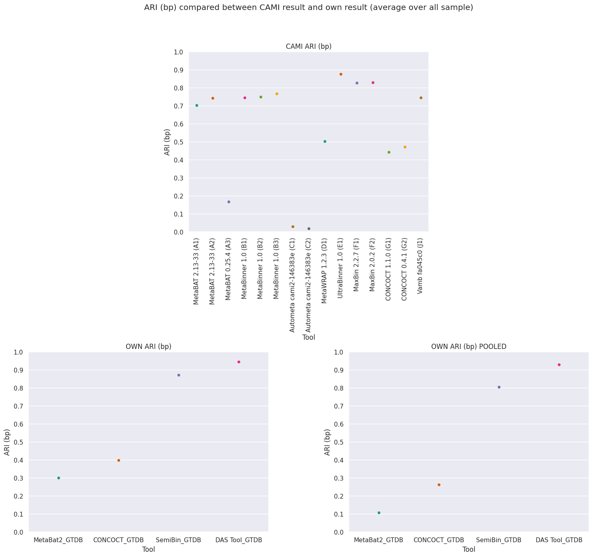

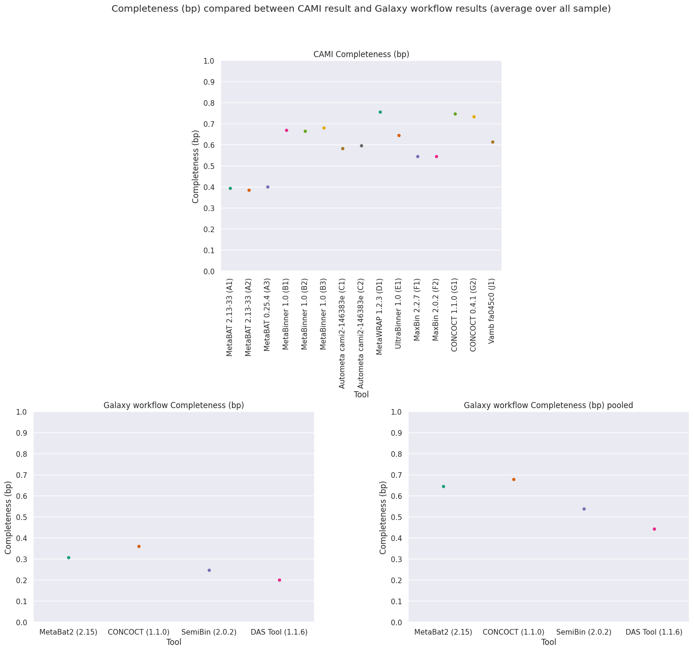

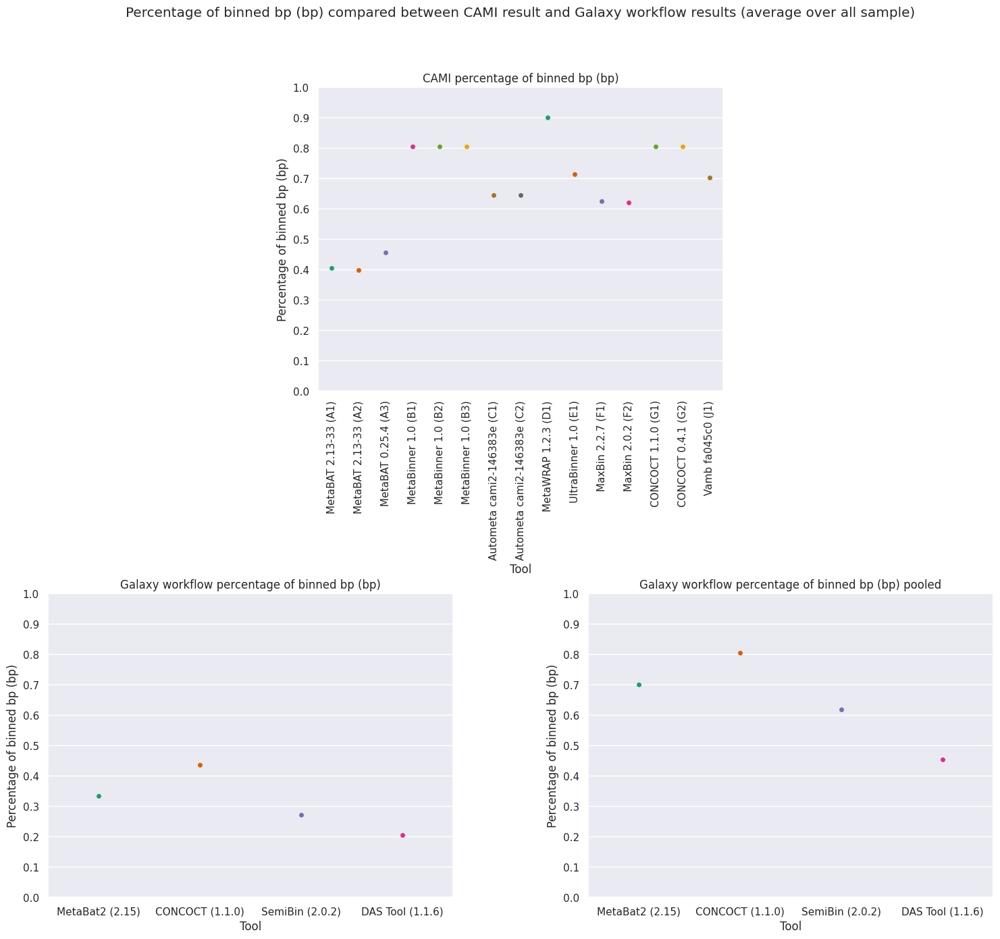

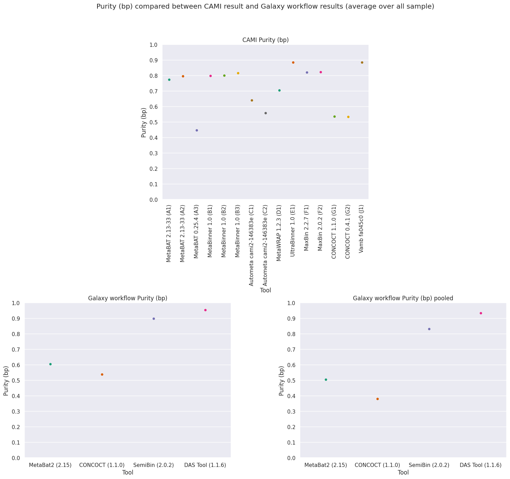

## Binner compare plots
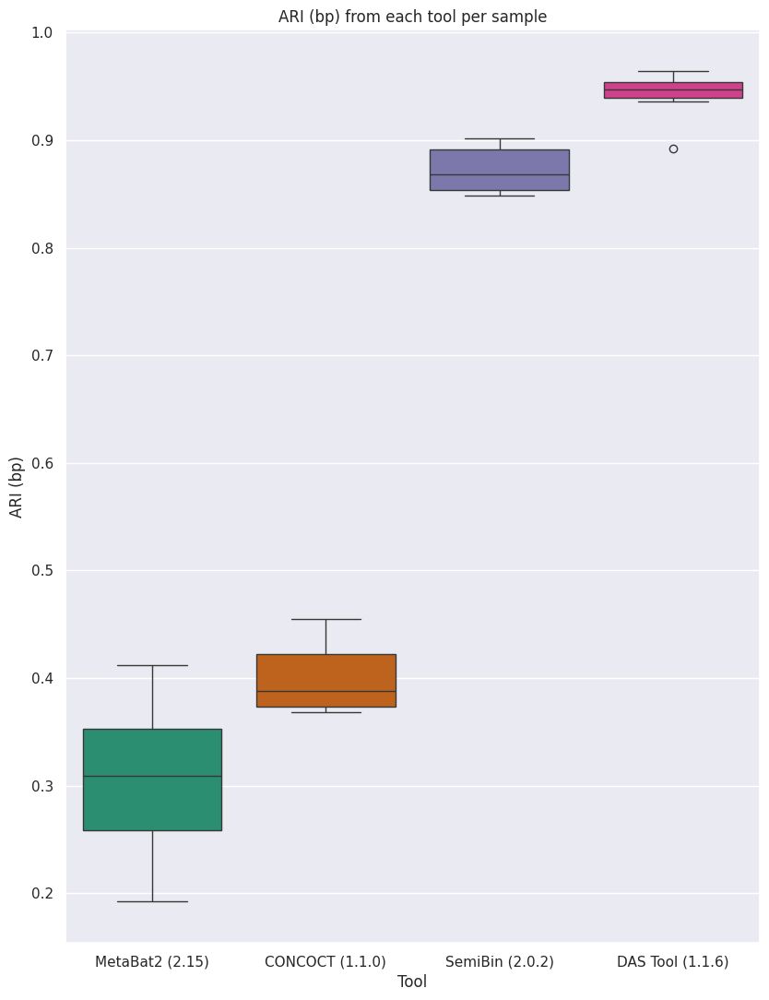

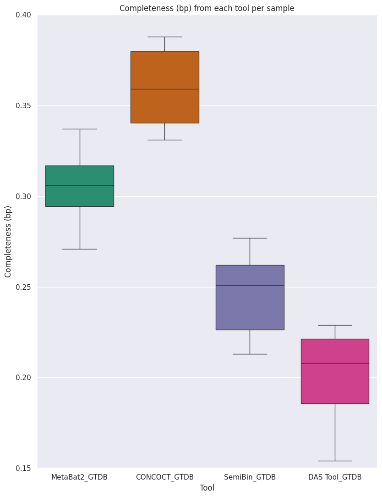

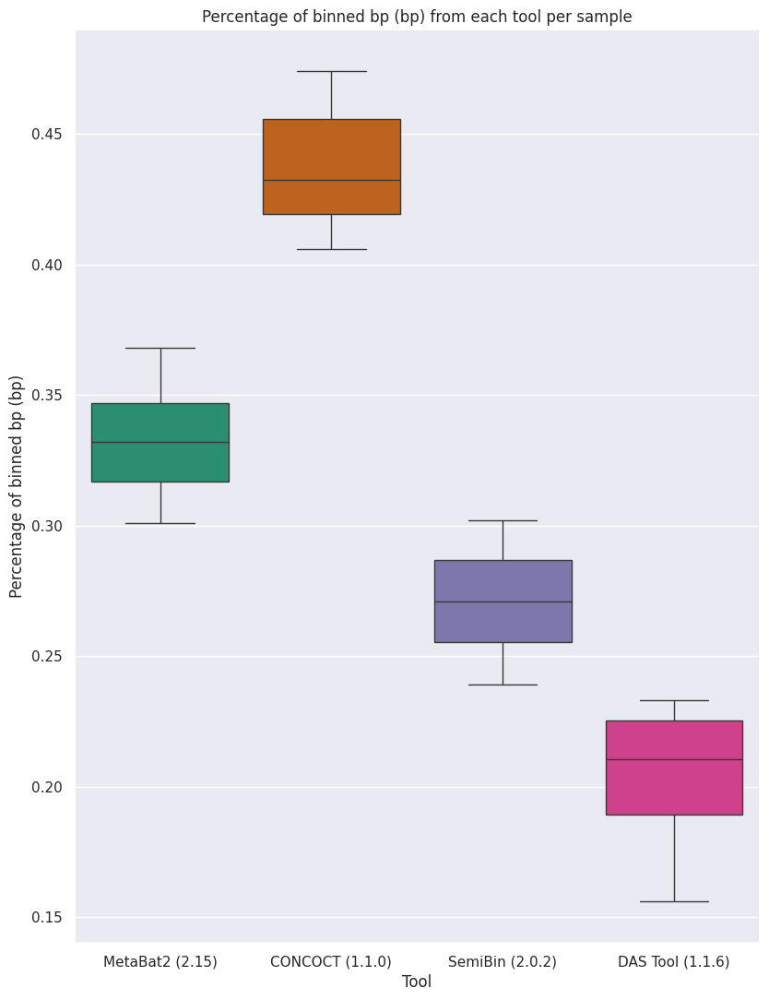

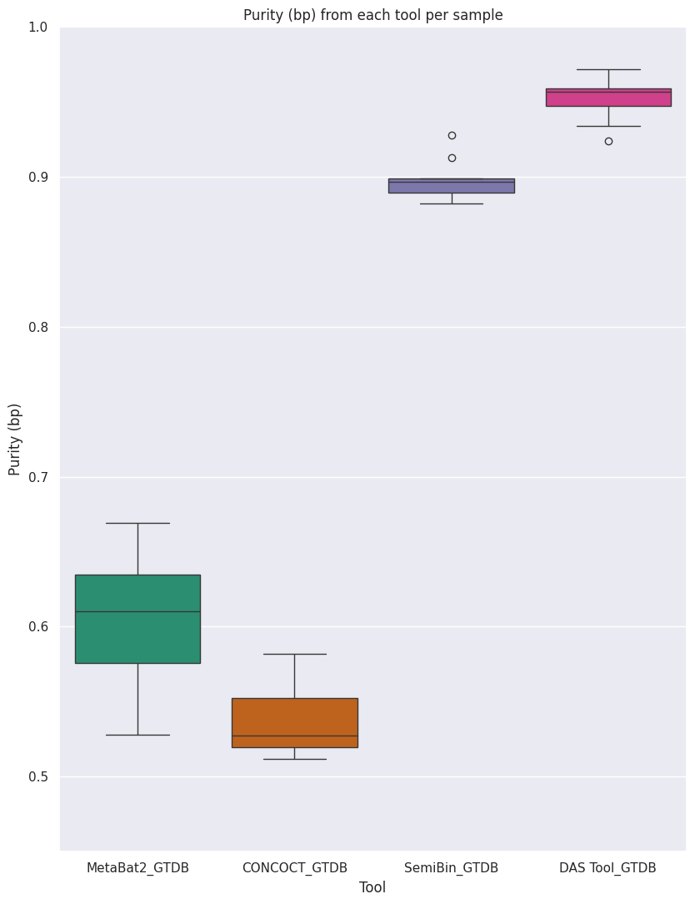

## Recover genomes plot

## Taxonomic compare between CAMI and Workflow
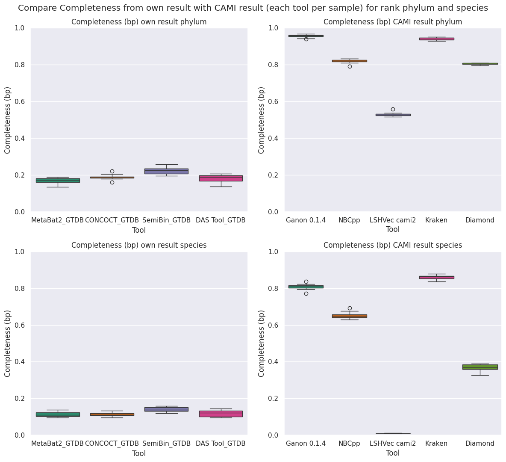

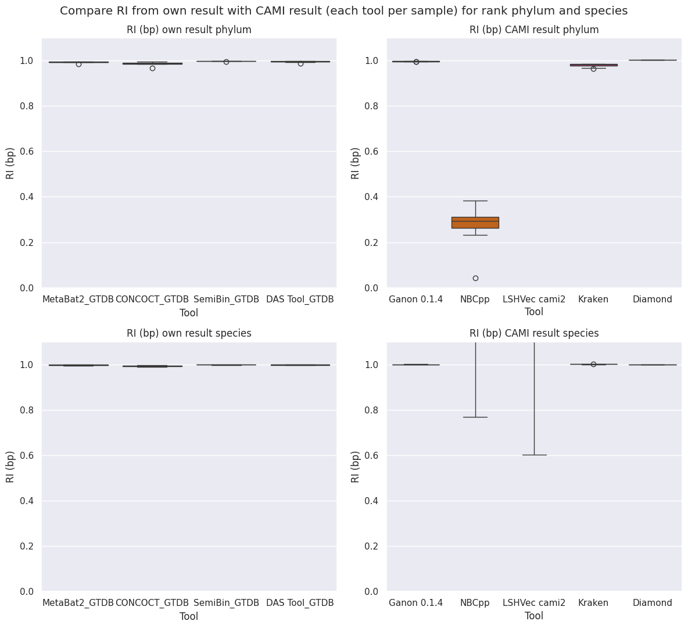

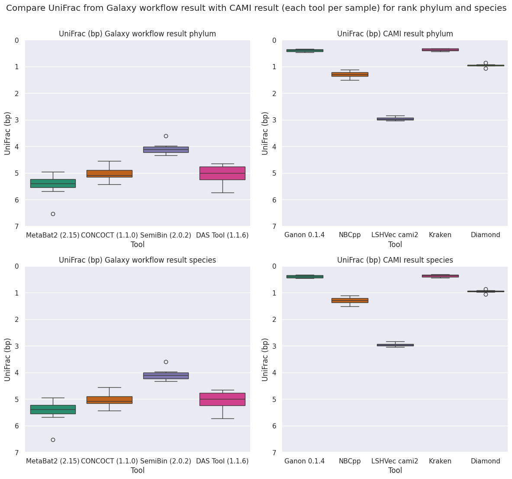
